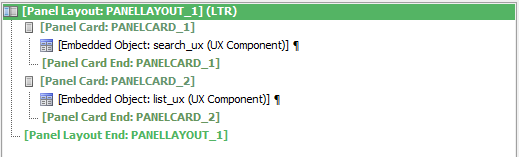
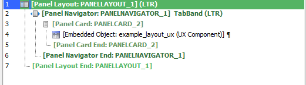
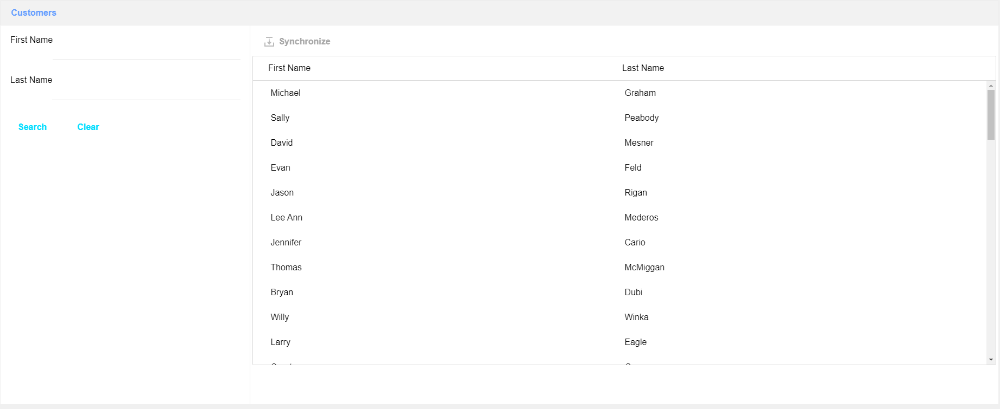
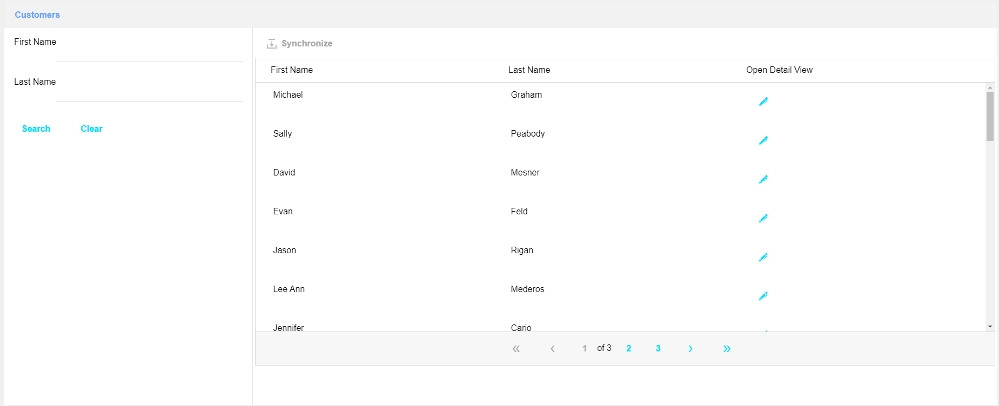
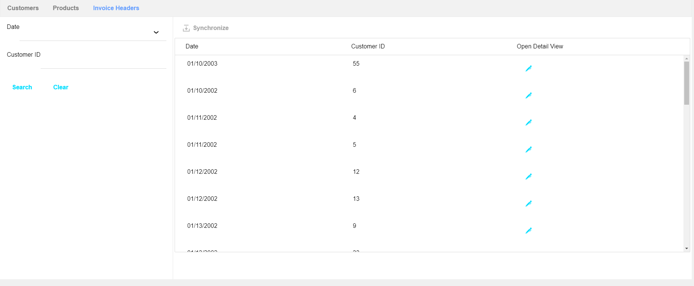
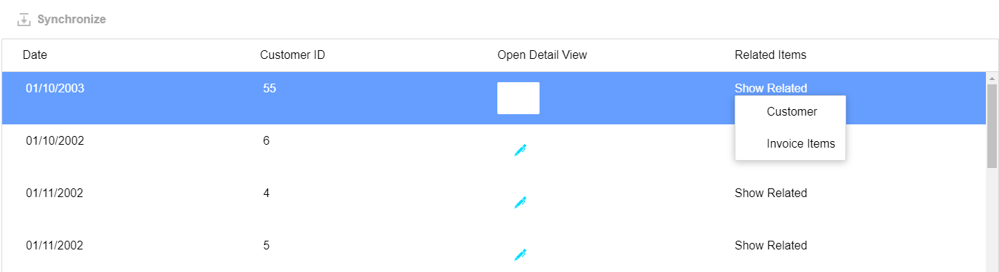

# Dynamic List Tutorial 

## Overview
This project aims to automate the process of building CRUD lists. 

There are two Javascript classes at work: `DynamicList` and `DynamicListSearch`.
`DynamicList` builds a list and connects to a database, and `DynamicListSearch` provides 
inputs for searching the list. 

Layouts can be built using `DynamicList` and `DynamicListSearch` and hooked together into a complete application.

This tutorial will be a structured walkthrough of setting up a simple application, with additional details provided for each section.


# Setting Up

## Building a Layout
The first thing we'll do is build a layout containing our Search and List UXs. Create a new UX (I call mine `example_layout_ux`) and define a Panel Layout with two panels. Panel 1 contains an Embedded Object pointing to `search_ux`, and panel 2 contains an Embedded Object pointing to `list_ux`.



Additionally, define an Alias for each Embedded Object. Set the `search_ux` alias to `SEARCH` and the `list_ux` alias to `DYNAMIC_LIST`.

This layout will hold a *single* list and search form.

--- 

Next, we'll define the "home page", where we can show multiple lists. Create a new UX (I call mine `main_layout_ux`) with a Panel Navigator. Add a single Panel Card to the navigator with an Embedded Object pointing to the UX we created above (in my case, I point it to `example_layout_ux`). Set the panel title to `Customers`.



Again, add an alias to this Embedded Object. We'll show a list of customers, so use the alias `CUSTOMER_LIST`.

If you try running this, you will just get an empty list. Our next step is to populate the list with data. 

## Populating the List
We need a way to communicate from the main layout to each embedded layout. There are several ways of doing this. I found it easiest to register a callback to the dialog object itself. Go to the `afterPrepare` event on your list layout (mine is `example_layout_ux`) and paste the following code.

```js
{dialog.object}.populateDynamicElements = function(config, openCallback, filters = []) {
    let load = setInterval(() => {
        // Get the embedded objects
        let embeddedList = {dialog.object}.getChildObject('DYNAMIC_LIST');
        let embeddedSearch = {dialog.object}.getChildObject('SEARCH');

        // Embedded objects don't load until *after* the parent component is loaded. 
        // This code will run every 200ms until both objects are defined.
        if (!embeddedList || !embeddedSearch) return;

        let list = new DynamicList(embeddedList, config, openCallback, filters);
        let search = new DynamicListSearch(list, embeddedSearch);

        // Both objects have been defined, so we can stop running this function
        clearInterval(load);
    }, 200);
}
```

For now, ignore `config`, `openCallback`, and `filters` -- they won't be important until later. The important part is that we create our `DynamicList` and `DynamicListSearch` objects.

--- 

Next, open your main layout (mine is called `main_layout_ux`). Find the Embedded Object and open the `onLoadComplete Javascript` property. Put in the following code.

```js
let embeddedObj = {dialog.EmbeddedUX_CUSTOMER_LIST};
embeddedObj.populateDynamicElements(CUSTOMER_CONFIG, openNewCallback);
```

Notice that `populateDynamicElements` is the function we just defined. 

--- 

The last thing we need is the `CUSTOMER_CONFIG` and `openNewCallback` definitions. Go to the `Javascript Functions` section of your main layout and add the following code.

```js
let CUSTOMER_CONFIG = {
    table: 'Customer',
    buttons: [],
    mappings: [
        {
            columnName: 'CUSTOMER_ID',
            inList: false,
        },
        {
            columnName: 'FIRSTNAME',
            displayName: 'First Name',
            inList: true,
        },
        {
            columnName: 'LASTNAME',
            displayName: 'Last Name',
            inList: true,
        }
    ]
};

function openNewCallback(config, titleName, filters) {
    // Nothing here yet
}

```

Going into **Live Preview** (**not** Working Preview), you should see the following. 



This list is searchable (try it!) but doesn't have many other features. Let's add some now.

## More Features 

There are a lot of customers, so we'd like to add pagination. 
Edit `CUSTOMER_CONFIG` to add the following.

```js
let CUSTOMER_CONFIG = {
    ...
    paginate: {
        pageSize: 30
    }
    ...
}
```

We would also like to edit the customer's information. To do this, we need to add a button to open the detail view. Edit the `CUSTOMER_CONFIG` to add it. Additionally, we must specify each mapping that we want in the detail view.

```js
let CUSTOMER_CONFIG = {
    ...
    buttons = [
        {
            columnTitle: 'Open Detail View',
            icon: 'svgIcon=#alpha-icon-edit:icon,24',
            onClick: (list) => list.openDetailView(),
        }
    ],
    mappings: [
        {
            columnName: 'CUSTOMER_ID',
            inList: false,
            inDetailView: false,
        }
        {
            columnName: 'FIRSTNAME',
            displayName: 'First Name',
            inList: true,
            inDetailView: true,
        },
        {
            columnName: 'LASTNAME',
            displayName: 'Last Name',
            inList: true,
            inDetailView: true,
        }
    ]
}
```

Notice that we have an `onClick` callback taking a parameter `list`. This parameter is an instance of `DynamicList`, the class we created earlier. We call the `openDetailView` method to open the detail view to the currently selected row.

Opening this in Live Preview should yield the following. 



Clicking the edit icon will open the detail view, which allows you to do CRUD operations on your data. Additionally, note the pagination links at the bottom of the page.

## Creating More Lists
Most of the setup work has already been completed in previous steps, so it is easy to add new lists. Let's make a few more.

Go to your main layout and add two new Panel Cards. Add an Embedded Object to each, pointing towards the single list layout (`example_layout_ux`, in my case). Set the first new panel card's alias to `PRODUCT_LIST` and the second's to `INVOICE_LIST`.
Add the following Javascript to the `onLoadComplete Javascript` property for each.
Set the panel titles to `Products` and `Invoice Headers`, respectively. 

```js
// For onLoadComplete: PRODUCT_LIST
let embeddedObj = {dialog.EmbeddedUX_PRODUCT_LIST}
embeddedObj.populateDynamicElements(PRODUCT_CONFIG, openNewCallback);

// For onLoadComplete: INVOICE_LIST
let embeddedObj = {dialog.EmbeddedUX_INVOICE_LIST}
embeddedObj.populateDynamicElements(INVOICE_HEADER_CONFIG, openNewCallback);
```

Next, go to the `Javascript Functions` section of the main layout. Define the following two configs. 

```js
let PRODUCT_CONFIG = {
    table: 'Product',
    buttons: [
        {
            columnTitle: 'Open Detail View',
            icon: 'svgIcon=#alpha-icon-edit:icon,24',
            onClick: (list) => list.openDetailView()
        }
    ],
    mappings: [
        {
            columnName: 'PRODUCT_ID',
            inList: false,
            inDetailView: false,
        },
        {
            columnName: 'DESCRIPTION',
            displayName: 'Description',
            inList: true,
            inDetailView: true,
            width: "flex(2)"
        },
        {
            columnName: "COST",
            displayName: "Cost",
            editType: 'number',
            inList: true,
            inDetailView: true,
            template: "${COST}"
        },
        {
            columnName: "RETAIL",
            displayName: "Retail",
            inList: true,
            inDetailView: true,
            editType: 'number',
            template: "${RETAIL}"
        }
    ]
};

let INVOICE_HEADER_CONFIG = {
    table: "Invoice_Header",
    buttons: [
        {
            columnTitle: 'Open Detail View',
            icon: 'svgIcon=#alpha-icon-edit:icon,24',
            onClick: (list) => list.openDetailView()
        }
    ],
    mappings: [
        {
            columnName: "INVOICE_NUMBER",
            inList: false,
            inDetailView: false
        },
        {
            columnName: "INV_DATE",
            displayName: "Date",
            inList: true,
            inDetailView: true,
            editType: "date",
        },
        {
            columnName: "CUSTOMER_ID",
            displayName: "Customer ID",
            inList: true,
            inDetailView: true,
            editType: 'number',
        },
    ]
};
```

We have a few new things here. The `width` property of a mapping specifies its column width. The `editType` property specifies the data type, and is used in sorting and editing. The `template` property allows for a client-side HTML template to be used to format the data. 

Opening the component in Live Preview should result in a Panel Navigator with three panes, each containing a unique list.



## Hooking Lists Together

We have several individual lists now, but how do we link them together? The first step is to finally define the `openNewCallback` function. Go to the `Javascript Functions` section of the main layout and add the following definition. 

```js
let counter = 0;
let title = 'New Tab';
function NEWPANELALIAS() {
	return 'DYNAMIC_LIST_RUNTIME_' + counter.toString();
}

function newPanelTitle() {
	return title;
}

function openNewCallback(config, titleName, filters) {
	title = titleName;
	counter += 1;
	let open = () => {dialog.object}.runAction('Open Panel');
	let build = () => {
		let name = NEWPANELALIAS() + '_DlgObj';
		let newObj = window[name];
		newObj.populateDynamicElements(config, openNewCallback, filters);
	};
	A5.executeThisThenThat(open, build);
}

```

The functions `NEWPANELALIAS` and `newPanelTitle` are defined so that we can reference them in the Action Javascript used to open a panel, which we will define now. 

In the main layout UX, create a new Action Javascript item. Add the `Open a UX Component` action and change the following:
- Point it to the single list layout (mine is `example_layout_ux`)
- Set the UX alias to `JAVASCRIPT_NEWPANELALIAS`
- Set the target to `DynamicPanel` and the navigator to your Panel Navigator
- Set the `Dynamic Panel Title` to `javascript:newPanelTitle`
- Check the `User can close dynamic panel` box

Finally, we must define buttons in the configuration objects that point to other lists. Add the following Javascript to `CUSTOMER_CONFIG`.
```js
// In the CUSTOMER_CONFIG object
buttons: [
    ...
    {
        title: 'Open Invoices',
        columnTitle: 'Customer Invoices',
        onClick: (list) => {
            let filters = list.makeFilterFromSelected('CUSTOMER_ID', 'CUSTOMER_ID');
            list.openNew(INVOICE_HEADER_CONFIG, 'Invoice Headers', filters);
        }
    }
]
```
The function `makeFilterFromSelected` is important. The first argument specifies the field *for this selected item* and the second field is a foreign key.

The `openNew` function is also important. We supply the configuration of the list we'd like to open, a title, and the filters. Note that the configuration *does not* have to be a list we've already built -- it can be something totally new.

We can also build the title dynamically from the list data. The underlying list object is stored in the `listBox` property of `list`, so we could do the following:
```js
...
let data = list.listBox.selectionData[0];
let name = data.FIRSTNAME + ' ' + data.LASTNAME;
list.openNew(INVOICE_HEADER_CONFIG, 'Invoice Headers for ' + name, filters);
```

Then, for customer John Smith, we would open a new tab with the title `Invoice Headers for John Smith`.

The other configuration objects can be hooked up in the same way -- just be sure to supply the correct configuration object.

--- 

We can also define dropdowns to show multiple buttons. Add the following to `INVOICE_HEADER_CONFIG`:
```js
buttons: [
    {
        columnTitle: 'Related Items',
        title: 'Show Related',
        children: [
            {
                title: 'Customer',
                onClick: (list) => {
                    let filters = list.makeFilterFromSelected('CUSTOMER_ID', 'CUSTOMER_ID');
                    list.openNew(CUSTOMER_CONFIG, 'Customer', filters);
                }
            },
            {
                title: 'Invoice Items',
                onClick: (list) => {
                    let filters = list.makeFilterFromSelected('INVOICE_NUMBER', 'INVOICE_NUMBER');
                    list.openNew(INVOICE_ITEM_CONFIG, 'Invoice Items', filters);
                }
            }
        ]
    }
]
```
This results in a button that, when clicked, shows several options.

The `INVOICE_ITEM_CONFIG` object is already defined in the example for this project.
